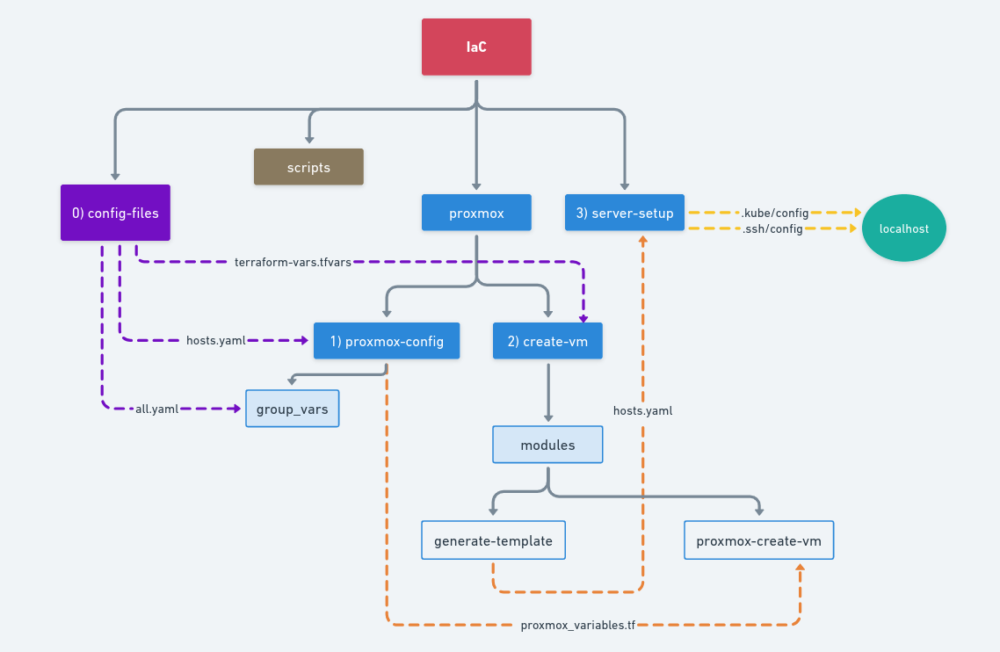

# IaC (Infrastructure as a Code)

<p align="left">
  <a href="http://creativecommons.org/licenses/by-nc-sa/4.0/">
    
  </a>
</p>

## Description

Code responsable to deploy all my infra in Proxmox, everything by code.
Features:
 - Send ssh public key to Proxmox server
 - Trigger an Ansible code to configure Proxmox
    -  Create user, and role permission
    -  Create a VM Template in Proxmox with Rocky Linux (cloud-init image)
 - Trigger a Terraform code, to create all VMs
 - Trigger an Ansible code to configure all VMs
-  Install Kubernetes cluster with k3s

## It is divided by:

- `scripts`: folder with auxiliar scripts
- `proxmox`: Folder with all necessary code to create and configure Vms in Proxmox hypervisor
- - `proxmox-config`: Ansible code, to configure Proxmox server and create VM Template
    - `create-vms`: Terraform code, to create all VMs
- `servers-setup`: Ansible code to install and configure all servers

## How to use

### Config files
First of all, **review and edit** all necessary config files, there are in `config-files/sample` folder.
Make a copy of this folder, running the command:
```bash
make init-config-files
```

After that, **open, review and edit** all files into a new folder called `config-files/my-configs`
When all files are configured, run this command to install them:
```bash
make install-config-files
```

### Deploy infra
When all config files are filled and revised, run this command to start the complete deploy process:
```bash
make proxmox-build
```

this command takes a while, around 10 minutes

### All Avaliable Commands
```bash
##################### Init Configs #####################

# copy the sample folder with config files
make init-config-files

# Install the config files, after changing them
make install-config-files

##################### Proxmox #####################

# Full Deploy: Configure Proxmox and after run the deploy
make proxmox-build

# Full Destroy: Destroy everything, reset Proxmox inclusive
make proxmox-reset

##################### VMs #####################

# Deploy all Infra, starting with clone VM template in Proxmox
make deploy-infra

# Destroy only Infra (VMs). Proxmox configs and VM Template remain intact
make destroy-infra


##################### Backup #####################

# Make backup of Infrastructure
make servers-backup
```

### Infra fluxogram
As the code uses some configuration files, and some others are automatically generated, so here is an image summarizing the flow of the solution

Legend:

- Purple lines: The config files that user configure mannually in the start of code
- Orange lines: Configuration files that are automatically generated and sent to their respective locations
- Yellow lines: Configuration files that are automatically generated and sent to my localhost




### License:

<p align="center">
  <a rel="license" href="http://creativecommons.org/licenses/by-nc-sa/4.0/">
    
  </a>
</p>