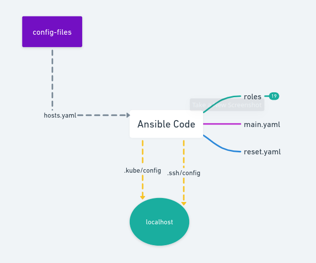
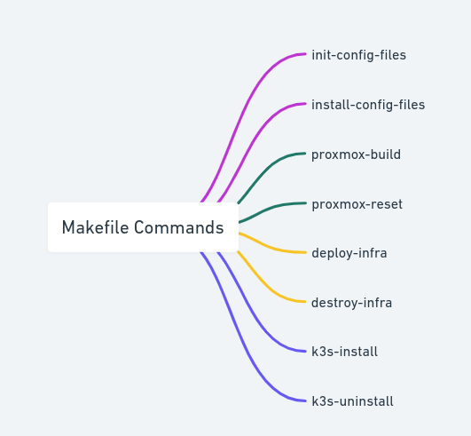

# IaC (Infrastructure as a Code)

<p align="left">
  <a href="http://creativecommons.org/licenses/by-nc-sa/4.0/">
    
  </a>
</p>

## Description

Code responsable to deploy all my infra in Proxmox, everything by code.
Features:
 - Send ssh public key to Proxmox server
 - Trigger an Ansible code to install al my infra
    -  Create user, and role permission
    -  Create a VM Template in Proxmox with Rocky Linux (cloud-init image)
    - Trigger a Terraform code, to create all VMs
    - Configure all VMs
    -  Install Kubernetes cluster with k3s

## It is divided by:

- `scripts`: folder with auxiliar scripts
- `src`: folder with Ansible code

## How to use

### Config files
First of all, **review and edit** the hosts.yaml file, there is in `config-files/sample` folder.
Make a copy of this folder, running the command:
```bash
make init-config-files
```

After that, **open, review and edit** the file into a new folder called `config-files/my-configs`
When hosts.yaml file are configured, run this command to install them:
```bash
make install-config-files
```

### Deploy infra
When all config files are filled and revised, run this command to start the complete deploy process:
```bash
make proxmox-build
```

this command takes a while, around 10 minutes

### All Avaliable Commands
```bash
##################### Init Configs #####################

# copy the sample folder with config files
make init-config-files

# Install the config files, after changing them
make install-config-files

##################### Proxmox #####################

# Full Deploy: Configure Proxmox and after run the deploy
make proxmox-build

# Full Destroy: Destroy everything, reset Proxmox inclusive
make proxmox-reset

##################### VMs #####################

# Deploy all Infra, starting with clone VM template in Proxmox
make deploy-infra

# Destroy only Infra (VMs). Proxmox configs and VM Template remain intact
make destroy-infra

##################### Kubernetes #####################

# Install K3s
make k3s-install

# Uninstall K3s
make k3s-uninstall

```

### Infra fluxogram
Here is an image summarizing the flow of the solution

The folder "config-file" created by the command `make init-config-files`, sends the `hosts.yaml` file into Ansible Code by the command `make install-config-files`.
The Ansible Code will launch many functions and on of them will bring to the localhost `.kube/config` of k8s-master. Additionally, the code will change the `.ssh/config` file by adding all the hosts configured in the `hosts.yaml` file.




This image show all the Makefile commands


### License:

<p align="center">
  <a rel="license" href="http://creativecommons.org/licenses/by-nc-sa/4.0/">
    
  </a>
</p>