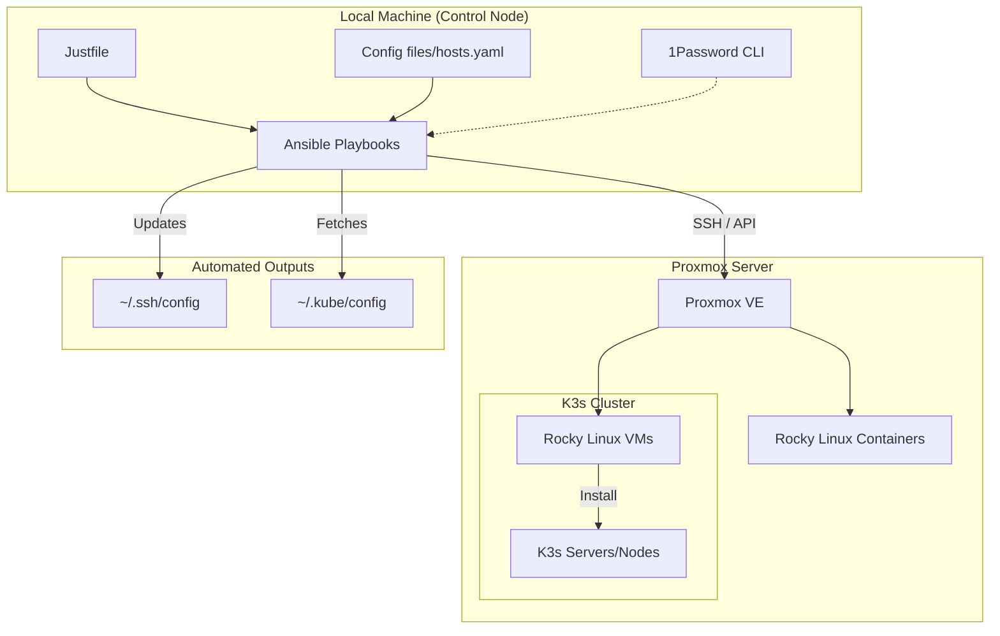

# Homelab IaC (Infrastructure as Code)

<p align="left">
  <a href="http://creativecommons.org/licenses/by-nc-sa/4.0/">
    
  </a>
  
  
  
  
  
  
</p>

## Concept & Proposal

The **Homelab IaC** project is a fully automated solution for deploying and managing a personal infrastructure on **Proxmox**. The core concept is to treat the homelab as a disposable and reproducible environment, allowing for rapid experimentation, scaling, and recovery.

### Proposal:
- **Reproducibility:** Rebuild the entire infrastructure from scratch in minutes.
- **Consistency:** Ensure all VMs and Containers follow the same configuration standards.
- **Security:** Integrate with 1Password for secret management and automate SSH key distribution.
- **Modern Stack:** Leverage Rocky Linux (Cloud-Init), K3s for lightweight Kubernetes, and Ansible for orchestration.

---

## High-Level Architecture


```mermaid
graph TD
    subgraph Localhost ["Local Machine (Control Node)"]
        J[Justfile] --> A[Ansible Playbooks]
        C[Config files/hosts.yaml] --> A
        OP[1Password CLI] -.-> A
    end

    subgraph ProxmoxHost ["Proxmox Server"]
        A -- SSH / API --> P[Proxmox VE]
        P --> VM[Rocky Linux VMs]
        P --> LXC[Rocky Linux Containers]
        
        subgraph Cluster ["K3s Cluster"]
            VM -- Install --> K[K3s Servers/Nodes]
        end
    end

    subgraph Outputs ["Automated Outputs"]
        A -- Updates --> SC[~/.ssh/config]
        A -- Fetches --> KC[~/.kube/config]
    end
```

---

## Prerequisites

Before starting, ensure you have the following installed on your control machine:

- **Just:** Command runner (alternative to Make).
- **Ansible:** Core orchestration engine.
- **Python 3 & Pip:** Required for Ansible collections and local scripts.
- **1Password CLI (`op`):** For secure secret retrieval.

### Python Dependencies:
The project uses `proxmoxer`, `requests`, `paramiko`, and `watchdog`. You can install them manually or let the init script handle it.

---

## Installation & Setup

1. **Clone the repository:**
   ```bash
   git clone https://github.com/frankjuniorr/homelab-iac.git
   cd homelab-iac
   ```

2. **Initialize configuration files:**
   This command copies the sample configuration to a private folder.
   ```bash
   just init-config-files
   ```

3. **Edit your configuration:**
   Open `config-files/my-configs/hosts.yaml` and adjust it to your Proxmox environment (IPs, node names, storage IDs, VM IDs).

4. **Install configurations:**
   ```bash
   just install-config-files
   ```

5. **Initialize the project:**
   This will check dependencies, install Ansible roles, and configure SSH on Proxmox.
   ```bash
   just init
   ```

---

## Usage (Justfile Commands)

The `Justfile` provides a simplified interface for all operations.

| Command | Description |
| :--- | :--- |
| `just init` | Full initialization: checks dependencies, installs galaxy roles, and configures Proxmox SSH. |
| `just proxmox-build` | **Full Deploy:** Creates VMs/Containers, configures users, and installs K3s. |
| `just deploy-infra` | Deploys only the infrastructure (VMs and Containers) and configures them. |
| `just k3s-install` | Installs the K3s cluster on already existing nodes. |
| `just proxmox-reset` | **Full Cleanup:** Destroys all VMs, Containers, and resets Proxmox settings. |
| `just destroy-infra` | Destroys only the VMs and Containers. |
| `just k3s-uninstall` | Removes K3s from the nodes without destroying the VMs. |
| `just save-data` | Performs a backup of critical services (like AdGuardHome) to localhost. |

---

## Project Structure

- `src/`: Contains all Ansible playbooks, roles, and configuration.
- `config-files/`: Templates and user-specific configurations.
- `scripts/`: Auxiliary bash scripts for environment checks.
- `images/`: Documentation assets and diagrams.

---

## License

<p align="center">
  <a rel="license" href="http://creativecommons.org/licenses/by-nc-sa/4.0/">
    
  </a>
  <br />
  Licensed under a <a rel="license" href="http://creativecommons.org/licenses/by-nc-sa/4.0/">Creative Commons Attribution-NonCommercial-ShareAlike 4.0 International License</a>.
</p>
