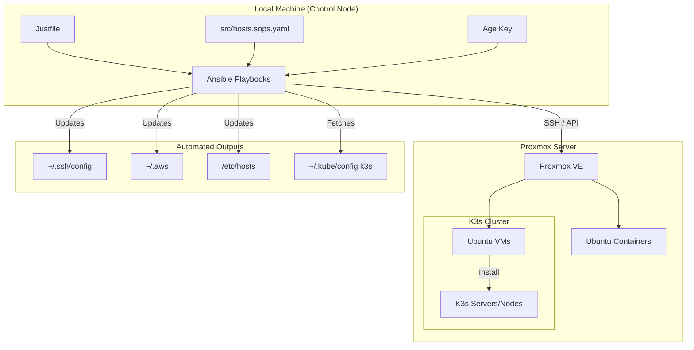
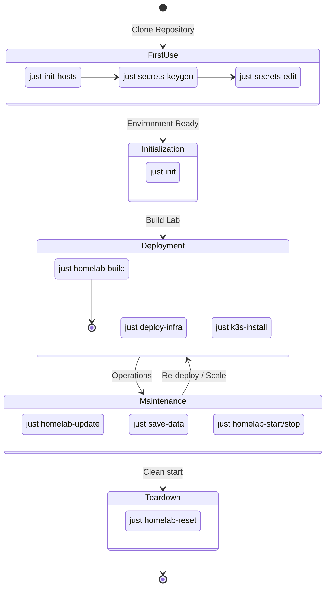

# Homelab IaC (Infrastructure as Code)

  
  
  
  
  
  
  

## Concept & Proposal

The **Homelab IaC** project is a fully automated solution for deploying and managing a personal infrastructure on **Proxmox**. The core concept is to treat the homelab as a disposable and reproducible environment, allowing for rapid experimentation, scaling, and recovery.

### Proposal:
- **Reproducibility:** Rebuild the entire infrastructure from scratch in minutes.
- **Consistency:** Ensure all VMs and Containers follow the same configuration standards.
- **Security:** Use SOPS + Age for secret management and automate SSH key distribution.
- **Modern Stack:** Leverage Ubuntu (Cloud-Init), K3s for lightweight Kubernetes, and Ansible for orchestration.

---

## Prerequisites & Dependencies

The project relies on several tools and libraries. While the `just init` command attempts to install Python libraries automatically, the core binaries must be present on your system.

### 1. Mandatory System Binaries
Ensure these are installed and available in your `$PATH`:

| Tool | Purpose |
| :--- | :--- |
| [Just](https://github.com/casey/just) | Command runner for all project tasks. |
| [Ansible](https://www.ansible.com/) | Core orchestration and deployment engine. |
| [SOPS](https://github.com/getsops/sops) | Secret encryption/decryption. |
| [Age](https://github.com/FiloSottile/age) | Modern encryption tool (backend for SOPS). |
| [1Password CLI](https://developer.1password.com/docs/cli/) | Secure retrieval of SSH keys and tokens. |
| [AWS CLI](https://aws.amazon.com/cli/) | Required to interact with Garage S3 buckets. |
| **Python 3 & Pip3** | Required for Ansible and auxiliary scripts. |

### 2. Python Libraries
These are automatically checked and installed during `just init`:
- `watchdog`: Used for the aesthetic output plugin.
- `paramiko`: Required for custom SSH key management modules.
- `proxmoxer`: Interface for Proxmox API.
- `requests`: HTTP library for API communications.

---

## High-Level Architecture

```mermaid
graph TD
    subgraph Localhost ["Local Machine (Control Node)"]
        J[Justfile] --> A[Ansible Playbooks]
        H["src/hosts.sops.yaml"] --> A
        AGE[Age Key] --> A
    end

    subgraph ProxmoxHost ["Proxmox Server"]
        A -- SSH / API --> P[Proxmox VE]
        P --> VM[Ubuntu VMs]
        P --> LXC[Ubuntu Containers]
        
        subgraph Cluster ["K3s Cluster"]
            VM -- Install --> K[K3s Servers/Nodes]
        end
    end

    subgraph Outputs ["Automated Outputs"]
        A -- Updates --> SC["~/.ssh/config"]
        A -- Updates --> AC["~/.aws"]
        A -- Updates --> EH["/etc/hosts"]
        A -- Fetches --> KC["~/.kube/config.k3s"]
    end
```

### Local Files Management

To provide a seamless experience, the project automatically manages several configuration files on your **Local Machine (Control Node)**:

1.  **`~/.ssh/config`**: Configures SSH access to all homelab nodes, including 1Password agent integration.
2.  **`~/.aws/`**: Generates `config` and `credentials` for the AWS CLI to interact with the Garage S3 API.
3.  **`/etc/hosts`**: Maps the IP addresses of all VMs and Containers to their respective hostnames for local resolution.
4.  **`~/.kube/config.k3s`**: Fetches and updates the Kubernetes configuration to allow `kubectl` to manage the K3s cluster.

---

## Lifecycle Workflow

The following diagram illustrates the recommended sequence of commands to get your homelab up and running:

```mermaid
stateDiagram-v2
    [*] --> FirstUse: Clone Repository
    
    state FirstUse {
        direction LR
        A: just init-hosts
        B: just secrets-keygen
        C: just secrets-edit
        A --> B
        B --> C
    }
    
    FirstUse --> Initialization: Environment Ready
    
    state Initialization {
        D: just init
    }
    
    Initialization --> Deployment: Build Lab
    
    state Deployment {
        E: just homelab-build
        F: just deploy-infra
        G: just k3s-install
        E --> [*]
    }
    
    state Maintenance {
        H: just homelab-update
        I: just save-data
        J: just homelab-start/stop
    }
    
    state Teardown {
        K: just homelab-reset
    }
    
    Deployment --> Maintenance: Operations
    Maintenance --> Deployment: Re-deploy / Scale
    Maintenance --> Teardown: Clean start
    Teardown --> [*]
```

---

## Secrets Management (SOPS + age)

To keep the repository public and secure, this project uses **SOPS** with **age**. This allows the `src/hosts.sops.yaml` file to remain in Git version control while keeping all sensitive values encrypted.

### 1. Installation
Ensure you have [sops](https://github.com/getsops/sops) and [age](https://github.com/FiloSottile/age) installed on your control machine.

### 2. Initial Setup
1.  **Generate your private key:** `just secrets-keygen`.
2.  **Prepare your hosts file:** `just init-hosts`.
3.  **Encrypt and Edit:** `just secrets-edit`.

Always use `just secrets-edit` to manage your variables.

---

## Usage (Justfile Commands)

### 1. First Use & Initialization
*Commands to prepare the environment and dependencies.*

| Command | Description |
| :--- | :--- |
| `just init-hosts` | Initializes `src/hosts.sops.yaml` from the sample template. |
| `just secrets-keygen` | Generates a new Age key pair for SOPS in `~/.config/sops/age/keys.txt`. |
| `just secrets-edit` | Decrypts, opens in your editor, and re-encrypts the hosts file on save. |
| `just init` | Installs git hooks, checks dependencies, installs Ansible roles, and configures Proxmox SSH. |

### 2. Deployment
*Commands to provision and configure the infrastructure.*

| Command | Description |
| :--- | :--- |
| `just homelab-build` | **Full Deploy:** Full initialization + VM/LXC creation + K3s installation. |
| `just deploy-infra` | Provisions only the VMs and Containers and configures basic services. |
| `just deploy-lxc` | **LXC Only:** Provisions and configures only the LXC Containers (DNS, S3). |
| `just deploy-vms` | **VMs Only:** Provisions and configures only the Virtual Machines (K3s). |
| `just k3s-install` | Installs or updates the K3s cluster on existing nodes. |

### 3. Maintenance & Operations
*Commands for daily management and updates.*

| Command | Description |
| :--- | :--- |
| `just homelab-update` | **Full Update:** Updates OS packages on Proxmox nodes, VMs, and Containers. |
| `just homelab-update-guests` | Updates OS packages only on VMs and Containers (Ubuntu). |
| `just homelab-update-proxmox` | Updates OS packages only on Proxmox host nodes (Debian). |
| `just save-data` | Backs up critical application data (e.g., AdGuardHome) to your local machine. |
| `just homelab-start` | Powers on all VMs and Containers in the Proxmox host. |
| `just homelab-stop` | Gracefully shuts down all VMs and Containers. |

### 4. Teardown
*Commands to clean up the environment.*

| Command | Description |
| :--- | :--- |
| `just homelab-reset` | **Full Cleanup:** Destroys all guests and resets Proxmox to a clean state. |
| `just destroy-infra` | Destroys only the VMs and Containers without affecting Proxmox host config. |
| `just k3s-uninstall` | Removes Kubernetes from the nodes without destroying the VMs. |

---

## Project Structure

- `src/`: Contains all Ansible playbooks, roles, and configuration.
- `config-files/`: Templates and user-specific configurations.
- `scripts/`: Auxiliary bash scripts for environment checks and git hooks.
- `images/`: Documentation assets and diagrams.

---

## License

  
   
  Licensed under a <a rel="license" href="http://creativecommons.org/licenses/by-nc-sa/4.0/">Creative Commons Attribution-NonCommercial-ShareAlike 4.0 International License</a>.

